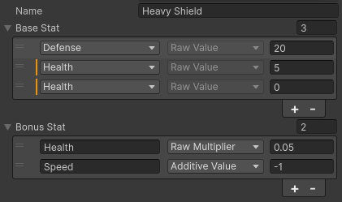

# High-Performance Event-Driven Stat System.

A lightweight, highly optimized, type-safe, and dependency-free Stat System written in pure C# with visualization in unity3d inspector. Designed as a universal, production-ready framework.

---

## 🚀 Key Features

*   **Zero Allocations (GC-Safe):** Evaluates modifiers and tracks bulk removals without allocating memory for closures or garbage collection overhead.
*   **High Performance / Lazy Evaluation:** Recalculations run *only* when an internal data-dirty flag is raised, meaning reading stats every frame (e.g., inside Unity UI Updates) is practically free.
*   **Strategy-Based Calculations (SOLID Open-Closed Principle):** Core mathematical operations are fully decoupled from the `Stat` logic via the `IStatCalculator` interface. Swapping from standard RPG formulas to unique custom scaling requires zero core code modification.
*   **Event-Driven Dynamic Modifiers (`INotifiableModifier`):** Perfect for runtime scaling values (e.g., Berserk buff scaling with missing health, proximity damage modifiers). Dynamic changes gracefully invalidate parent caches across multiple actors without continuous loop queries.
*   **Modern UI Toolkit Inspector with Validation:** Custom structural Property Drawers format arrays cleanly into a single row, auto-hides unnecessary labels, and highlights overlapping stat configurations via a non-intrusive amber-colored modern edge-strip warning.
*   **Decoupled Sync Layer (`StatsLinker`):** Bridge component to safely link game-specific subsystems (Inventory, Buff System, Talents) to the `StatsGroup` via event aggregators, protecting against memory leaks through native disposal architecture.

## 🛠️ Code Examples

### 1. Basic Setup & Recalculation Order

By default, the mathematical execution order adheres to:  
`Value = (RawValue * RawMultiplier + AdditiveValue) * ResultMultiplier`

To change this, create your own implementation of `IStatCalculator` and `IStatCalculationResult`.

```csharp
// Setup a stats group with the default calculator.
var stats = new StatsGroup();

stats.AddModifier(new StatModifier("Attack", ModificationType.RawValue, 100f));
stats.AddModifier(new StatModifier("Attack", ModificationType.RawMultiplier, 0.2f)); // +20% Base
stats.AddModifier(new StatModifier("Attack", ModificationType.AdditiveValue, 15f)); // +15 flat flat bonus

// Value is evaluated lazily on read: 100 * 1.2 + 15 = 135
Debug.Log(\$"Current Attack: {stats["Attack"].Value}"); 
```

### 2. Inspector Validation Attributes

Expose raw data properties within configuration profiles (`ScriptableObjects` or `MonoBehaviours`) cleanly.
StatModifierData is a structure for serializing data and using in the inspector.

```csharp
public enum RPGStats { Health, Mana, Attack, Defense, Speed }

[CreateAssetMenu(fileName = "ItemProfile", menuName = "Item/Profile")]
public class ItemProfile : ScriptableObject
{
    public string Name;
    // Forces the inspector layout dropdown choices via Enum, locks calculation phase type to RawValue,
    // and visually alerts designers via a modern orange sidebar if any overlapping entries share the same parameters.
    [LockModifierType(ModificationType.RawValue)]
    [StatEnum(typeof(RPGStats))]
    public List<StatModifierData> BaseStat;
    [LockModifierType(ModificationType.RawValue)]
    public List<StatModifierData> BonusStat;
}
```


### 3. Modifier Source

```csharp
public class Item : IModifierSource
{
    private List<IModifier> _modifiers = new List<IModifier>();

    public Item (ItemProfile profile)
    {
        Name = profile.Name;
        // Convert StatModifierData to StatModifier with source object
        _modifiers.AddRange(profile.BaseStat.ToModifiers(this));
        _modifiers.AddRange(profile.BonusStat.ToModifiers(this));
    }

    public string Name { get; }
    public IEnumerable<IModifier> GetModifiers () => _modifiers;
}
```
```csharp
var myShield = new Item(HeavyShieldProfile);

var stats = new StatsGroup();
stats.AddModifiersFromSource(myShield);
// Removes all modifiers where myShield is specified as a source.
// This is a fast and cheap way without going through and comparing the list of modifications of the corresponding stats and modifications of the source.
stats.RemoveModifiersFromSource(myShield);
```

### 4. Aggregator

Sources can be various, such as leveling, equipped items, and statuses (passive abilities, buffs, debuffs, etc.). They are based on different handlers, and IModifierAggregator is a convenient way to automate the addition and removal of modifiers to StatsGroup from sources.
```csharp
public class Equipment : IModifierAggregator
{
    public event Action<IModifierSource> OnSourceAdded;
    public event Action<IModifierSource> OnSourceRemoved;
    public event Action OnAllSourcesUpdated;

    private List<Item> _items;

    public void Equip (Item item)
    {
        _items.Add(item);
        OnSourceAdded.Invoke(item);
    }

    public void Unequip (Item item)
    {
        _items.Remove(item);
        OnSourceRemoved.Invoke(item);
    }

    public IEnumerable<IModifierSource> GetModifierSources ()
        => _items.Cast<IModifierSource>();
}
```
```csharp
private StatsGroup _stats;
private StatsLinker _linker;

private void Start ()
{
    _stats = new StatsGroup();
    _linker = new StatsLinker(_stats);

    var equipment = new Equipment();
    _linker.RegisterAggregator(equipment);

    // Automatically add modifiers from new source.
    equipment.Equip(gloves);
    // Automatically remove modifiers from a remote source.
    equipment.Unequip(gloves);
}

private void OnDestroy ()
{
    // Don't forget to Dispose() StatsLinker to unsubscribe from aggregator events.
    _linker.Dispose();
}
```


---
